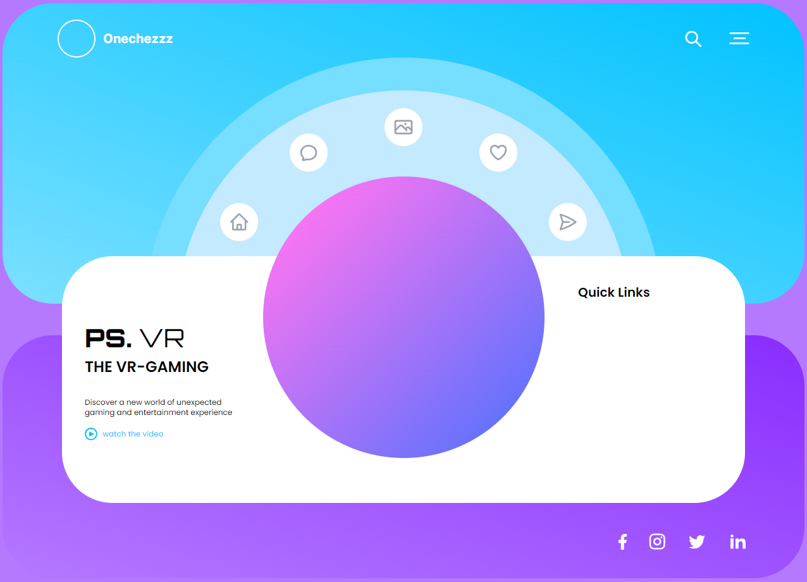

# Tailwind Landing VR Info Block Proto

This project demonstrates a infoblock using Tailwind CSS with the following features:
- We can switch current tabs with different text
- To start this project download the zip and doubleclick index.html

- 

